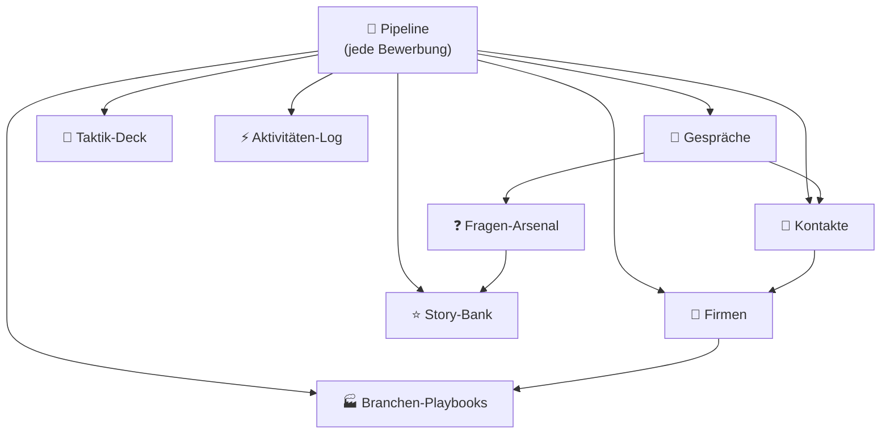

# 🎯 Job CRM — Mission Control

Ein Bewerbungs-CRM in Notion. Neun verknüpfte Datenbanken, ein Taktik-Deck aus
Gesprächspsychologie, Branchen-Playbooks und ein XP-System, das den Fortschritt
an Aktivität koppelt statt an Zusagen.

Dieses Repository enthält die **Dokumentation und den Bauplan** des Systems.
Das System selbst lebt in Notion.

---

## Warum es so gebaut ist

Die meisten Bewerbungs-Tracker scheitern an zwei Dingen:

1. **Sie messen das Falsche.** Wer Zusagen misst, sieht wochenlang nur Nullen
   und hört auf. Das XP-System misst Aktivität — auch eine Absage gibt Punkte,
   weil sie Information ist.
2. **Sie speichern Daten statt Munition.** Eine Tabelle mit Firmennamen hilft
   im Gespräch nicht. Story-Bank, Fragen-Arsenal und Taktik-Deck sind dafür da,
   dass im Interview das Richtige griffbereit ist.

---

## Die Architektur

### Die neun Datenbanken

| Datenbank | Zweck | Kernfelder |
|---|---|---|
| 📮 **Pipeline** | Jede Bewerbung als Zug im Spiel | Status, Match-Score, Nächster Schritt, Wunschgehalt, Schmerzgrenze |
| 🏢 **Firmen** | Company-Intel | Der Schmerzpunkt, Mein Angle, Green/Red Flags, Gehaltsniveau |
| 👤 **Kontakte** | Menschen entscheiden, nicht Firmen | Persönlichkeit (DISG), Hooks, Beziehungsstatus |
| 🎤 **Gespräche** | Vorbereitung + Debrief | Kaufsignale, Warnsignale, Gefühl danach, Follow-up |
| ⭐ **Story-Bank** | STAR-Stories, einmal sauber, hundertmal abgefeuert | Punchline, Die Zahl, Kompetenz, Schärfe |
| ❓ **Fragen-Arsenal** | Ihre Fragen + deine Killerfragen | Meine Antwort, Framework, Die Falle, Sicherheit |
| 🧠 **Taktik-Deck** | Gesprächspsychologie als Kartendeck | Der Satz, Warum es wirkt, Timing, Risiko |
| 🏭 **Branchen-Playbooks** | Pro Zielbranche ein Spielbuch | Der Code, Dresscode, Gehaltsband, Tempo |
| ⚡ **Aktivitäten-Log** | XP, Streak, Momentum | Typ, XP (auto), Monat |

---

## Die Automatiken

Alles rechnet sich selbst. Eintragen musst du nur Rohdaten.

| Feld | Was es tut |
|---|---|
| `Match` | Zehn-Segment-Balken aus dem Match-Score (0–100) |
| `Tage im Rennen` | Tage seit Absendedatum |
| `Follow-up` | 🟢 ruhig → 🟡 bald dran (ab 7 Tagen) → 🔴 NACHHAKEN (ab 14 Tagen). Abgeschlossene Bewerbungen fallen automatisch raus. |
| `Countdown` | 🔥 HEUTE / in N Tagen / 🛑 überfällig, bezogen auf `Fällig am` |
| `XP` | 25 für Beworben bis 500 für Unterschrieben. Absage gibt 10. |
| `Gehalts-Delta` | Ihr Angebot gegen dein Wunschgehalt, in Euro |
| `Anzahl Gespräche` | Rollup über verknüpfte Gespräche |

### XP-Tabelle (Aktivitäten-Log)

| Aktion | XP |
|---|---|
| 🎤 Gespräch geführt | 75 |
| 💪 Skill gelernt | 30 |
| 📤 Bewerbung raus | 25 |
| 🤝 Networking | 20 |
| 📝 Unterlagen gebaut | 20 |
| 🔁 Follow-up | 15 |
| 🧠 Taktik geübt | 15 |
| ❌ Absage kassiert | 10 |
| 🔍 Recherche | 10 |

---

## Views

**Pipeline** — 🎯 Board (nach Status) · ⏰ Was ansteht · 📅 Kalender · 💰 Am Geld · 📊 Funnel
**Taktik-Deck** — 🗂 Nach Kategorie · ⏱ Nach Gesprächsphase
**Fragen-Arsenal** — 🗂 Nach Typ · 🚨 Hier wackelt es
**Story-Bank** — 💎 Nach Kompetenz
**Kontakte** — 🔥 Beziehungsstatus
**Aktivitäten** — 📈 XP-Kurve · 📅 Streak-Kalender

---

## Der Taktik-Ansatz

Das Taktik-Deck enthält 27 Karten aus Gesprächspsychologie und Rhetorik —
Rapport, Framing, Reziprozität, Status, Verknappung, Storytelling,
Einwandbehandlung, Gehaltsverhandlung, Körpersprache, Sprachmuster.

Jede Karte hat einen wörtlichen Satz, den psychologischen Mechanismus dahinter
und eine Risikoeinstufung.

**Die Grenze, die im System eingebaut ist:** Diese Techniken verstärken
Substanz, sie ersetzen sie nicht. Karten, die ohne echte Deckung gefährlich
werden — etwa ein erfundenes konkurrierendes Angebot — sind als
🔴 *Nur wenn du sitzt* markiert und tragen eine explizite Warnung. Ein Reframe
dreht die **Bedeutung** eines Fakts; er erfindet keinen neuen. Wer hier lügt,
fliegt spätestens in der Probezeit auf, und dann ist der Schaden größer als die
Lücke je war.

---

## Bedienung

**Neue Bewerbung** → Pipeline, Zeile anlegen. Position, Firma, Status
`🔭 Auf dem Radar`, Match-Score schätzen. Fertig. Der Rest wächst mit.

**Vor jedem Gespräch** → Gespräche-Eintrag anlegen, mit der Bewerbung verknüpfen,
drei eigene Fragen notieren, zwei Taktik-Karten auswählen, drei Stories bereitlegen.

**Nach jedem Gespräch** → Innerhalb von zehn Minuten: Kaufsignale, Warnsignale,
Gefühl, nächster Schritt, `Fällig am` setzen. Danach vergisst du die Hälfte.

**Wöchentlich** → View ⏰ *Was ansteht* durchgehen. Alles auf 🔴 NACHHAKEN
abarbeiten. XP-Kurve anschauen.

---

## Lizenz / Nutzung

Privates Setup. Zahlen in den Branchen-Playbooks sind Orientierungswerte für den
deutschen Markt und sollten vor Verhandlungen gegen aktuelle Quellen geprüft
werden (Gehalt.de, Kununu, StepStone-Report, Levels.fyi, Tarifverträge).
